# Wolastoq BINGO - Step-by-Step Guide

**Live Site:** https://bingo-jk2h.onrender.com

## For Presentation & Testing

---

# PART 1: Buying Tickets (Customer Flow)

This is what a customer sees when they visit the site to purchase bingo tickets.

---

### Step 1: Open the Website

- Go to **https://bingo-jk2h.onrender.com**
- The site loads with the **Saint Mary's Entertainment Centre** branding.
- The first available bingo session is automatically selected.
- Any active announcements appear at the top of the page.


---

### Step 2: Choose a Session (Date & Time)

- Sessions are displayed in a **weekly calendar bar** at the top.
- Use the **left/right arrows** to navigate between weeks (e.g., "APR 6 - APR 12").
- Each session shows its **date, time, and available seats** (e.g., "Tue, Apr 7 - 6:30 PM (444)").
- The currently selected session is highlighted in **gold**.
- The legend below shows color codes:
  - **Green** = Available
  - **Amber** = Partial (some seats taken)
  - **Blue** = Your Pick (seats you selected)
  - **Gray** = Full (sold out)

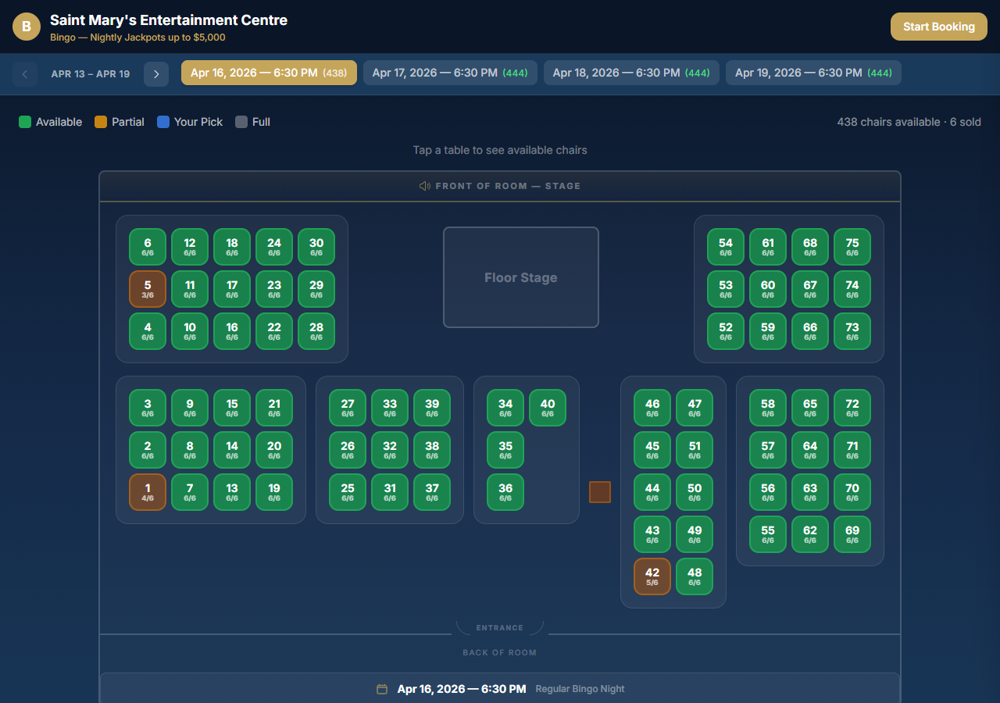

---

### Step 3: Select Your Seats on the Floor Map

- A **74-table floor plan** appears showing the venue layout (tables 1-75, skipping table 41).
- The floor plan shows "FRONT OF ROOM - STAGE" at the top and "ENTRANCE / BACK OF ROOM" at the bottom.
- Each table shows its number and available seats (e.g., "6/6").
- **Click a table** to expand it and see the individual chairs (6 per table, numbered 1-6).
- The expanded table shows chairs on the left and right sides.

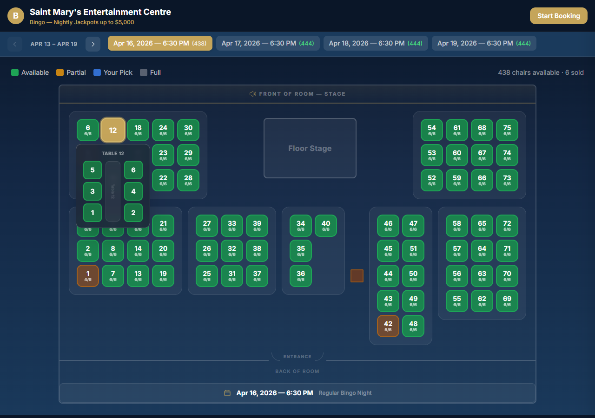

---

### Step 4: Lock a Seat

- **Click a chair number** inside the expanded table to lock it.
- The seat is held for **10 minutes** (a countdown timer appears in the header).
- Your locked seats turn **blue** on the floor map.
- Other customers see your locked seats in real time — they cannot double-book.
- The booking panel opens automatically after your first seat selection.


---

### Step 5: Choose Party Size & Enter Player Names

- After selecting a seat, the **booking panel** opens on the right side.
- Select your party size: **1 through 6** players.
  - 1 = "Just Me"
  - 2 = "Pair"
  - 3 = "Trio"
  - 4 = "Group of 4"
  - 5 = "Group of 5"
  - 6 = "Full Table"
- For each player, enter **First Name** and **Last Name**.
- The **base package** is automatically included (e.g., "Mega Bucks Bingo - $25.00").
- Optional **add-ons** can be selected with quantity controls (+/-).
- A **running subtotal** is shown for each player in gold text.

> **Note:** For special events, players will see the event's custom packages instead of the standard ones.

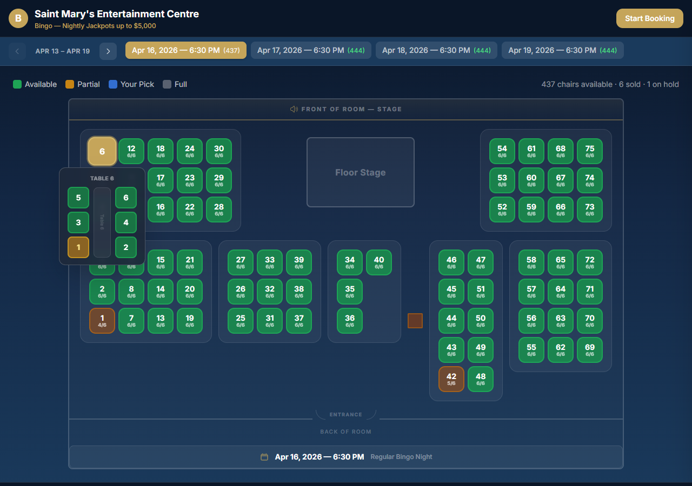

---

### Step 6: Review Your Order

- A summary screen shows:
  - **Session info**: date, time, venue
  - **Per-player breakdown**: name, table/seat assignment, packages, price
  - **Grand total** displayed prominently in gold
- Use the **Back** button to make changes, or **Next** to proceed to payment.

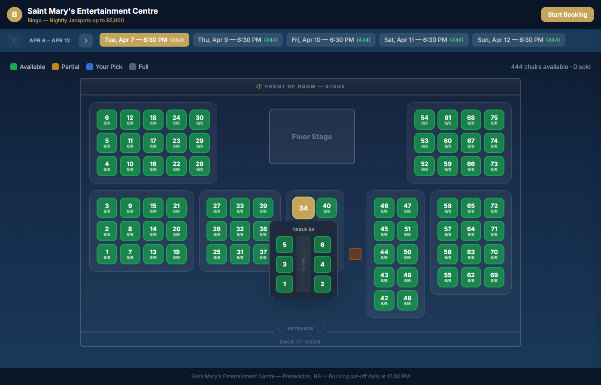

---

### Step 7: Enter Payment Information

- A yellow banner reminds you this is **demo mode** (no real charges).
- Fill in:
  - **Cardholder Name**
  - **Card Number** (auto-formats as you type, auto-detects Visa/Mastercard/Amex/Discover)
  - **Expiry Date** (MM/YY)
  - **CVV**
  - **Address**
  - **Postal Code**
- Click **"Complete Booking - $XX.XX"** to submit.

---

### Step 8: Booking Confirmation

- A **success screen** appears with a green checkmark.
- You see:
  - **Booking Reference Number** (format: BNG-XXXXXX) in large text
  - **Date and time** of the event
  - **Total paid**
  - **Your Seats**: all attendees with their table/seat assignments
- Two options:
  - **"View Printable Tickets"** - opens your tickets for printing
  - **"Start New Booking"** - returns to the homepage

---

### Step 9: Print Your Tickets (Optional)

- Tickets can be accessed anytime at **https://bingo-jk2h.onrender.com/tickets**
- Enter your **reference number** (BNG-XXXXXX) to look up your tickets.
- Each attendee gets a **double-sided tear-off ticket**:
  - **Left half (Venue Copy)**: attendee name prominent, event title, table/seat, price, reference
  - **Right half (Customer Copy)**: event title, table/seat prominent, attendee name, price, reference
- Optimized for **A4 printing** — use your browser's Print function (Ctrl+P).
- No login required — just the reference number.

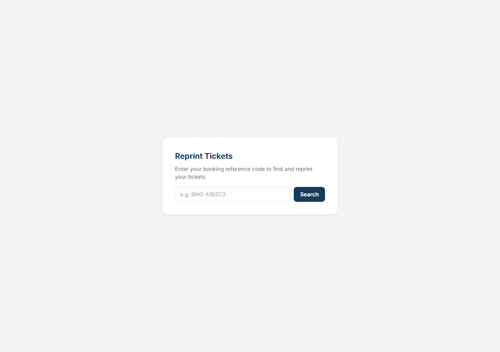

---
---

# PART 2: Setting Up Special Events (Admin Flow)

This is what an administrator does to create and manage special bingo events.

---

### Step 1: Log In to the Admin Panel

- Navigate to **https://bingo-jk2h.onrender.com/admin**
- You will see the Admin Panel login screen with the lock icon and "Saint Mary's Entertainment Centre" branding.
- Enter your **Username** and **Password**.
- Click **Sign In**.
- You are redirected to the **Admin Dashboard**.

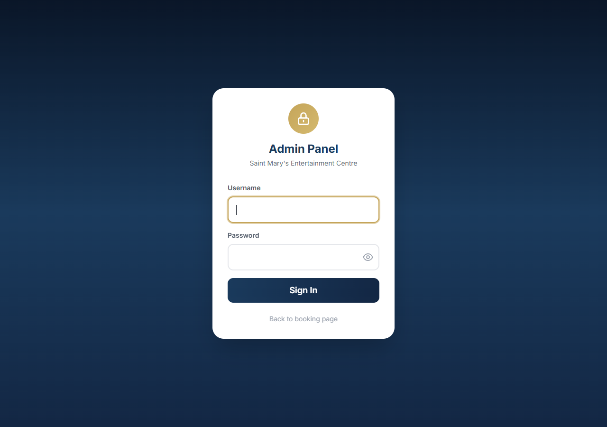

---

### Step 2: View the Dashboard

After logging in, you see the **SMEC Admin Panel** with key metrics at the top:

- **Today's Bookings** — number of bookings made today
- **Today's Revenue** — dollar amount earned today
- **Upcoming Sessions** — count of upcoming sessions

Below the metrics is a table of **Upcoming Sessions** showing date, time, available seats, sold seats, and held seats.

The dashboard has **6 tabs** across the top:

| Tab | Purpose |
|-----|---------|
| **Dashboard** | Key metrics and upcoming sessions overview |
| **Sessions** | Create and manage sessions/special events |
| **Packages** | View and manage global ticket packages |
| **Announcements** | Create public announcements |
| **Bookings & Reports** | View bookings, filter, export CSV |
| **Bulk Print** | Print all tickets for a date range |

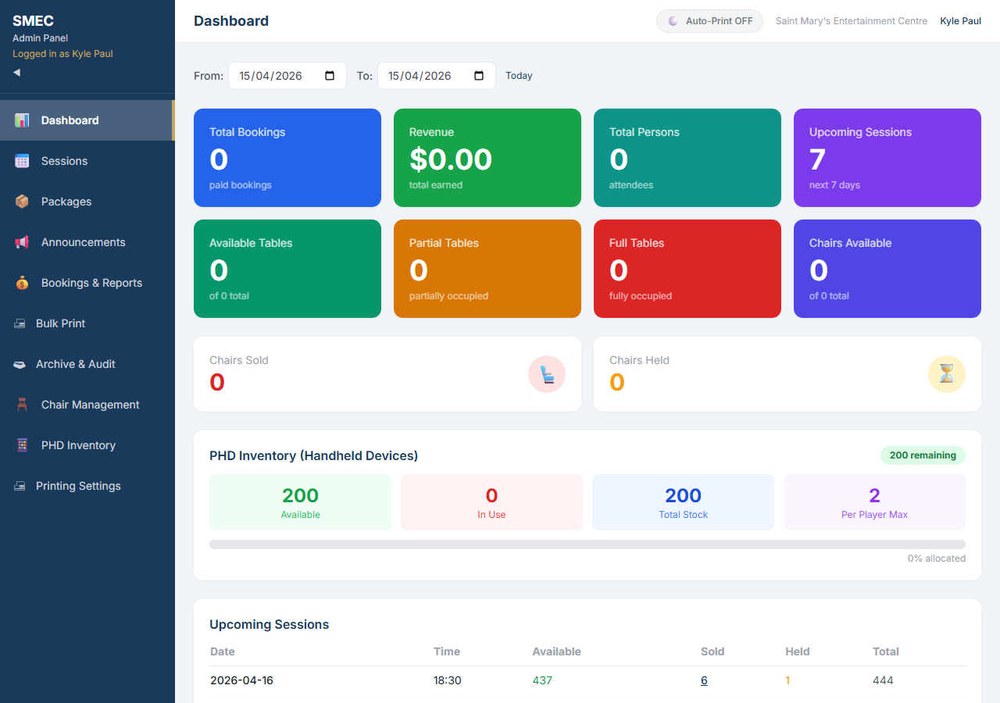

---

### Step 3: Go to Sessions Tab

- Click the **Sessions** tab.
- You see two sections:
  1. **Create New Session** form at the top — with Date, Time, Cutoff fields and an "Add Session" button
  2. **All Sessions** table below — listing every session with Date, Time, Cutoff, Type, Status, and Actions

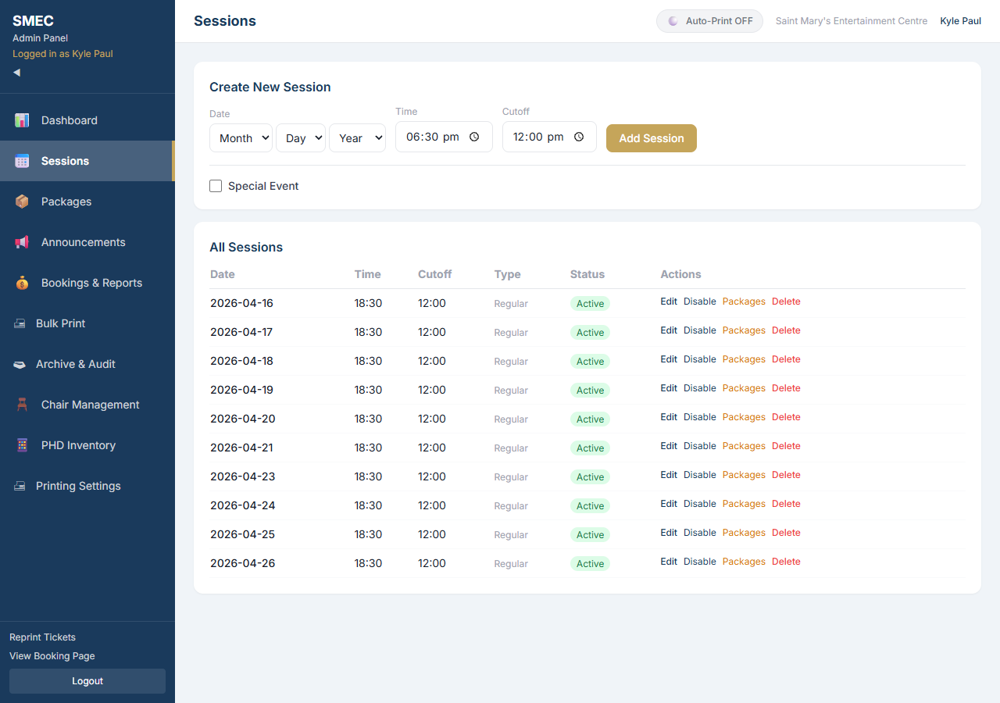

---

### Step 4: Create a New Special Event

In the **Create New Session** form:

1. **Enter the date** for the event (click the date picker).
2. **Enter the start time** (default: 6:30 PM).
3. **Enter the cutoff time** — when online booking closes (default: 12:00 PM).
4. **Check the "Special Event" checkbox**. The button changes to "Add Special Event" and an amber/yellow section expands below.


---

### Step 5: Fill In Special Event Details

After checking "Special Event", the expanded section shows:

- **Event Title** field (e.g., "Special Bingo Event 1") — required
- **Description** field (optional — visible to customers)
- **Event Packages** section with a **"+ Add Package"** link

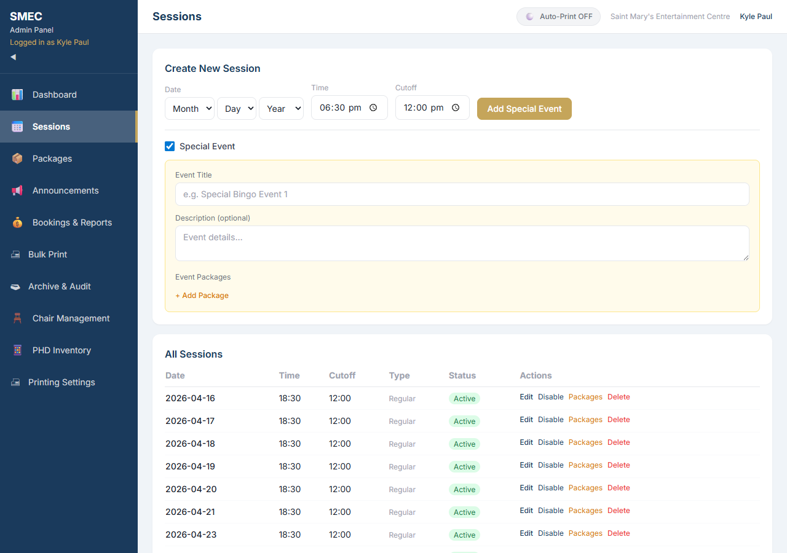

---

### Step 6: Configure Event Packages

Click **"+ Add Package"** to add custom packages for this event:

1. For each package, enter:
   - **Package Name** (e.g., "Premium Ticket", "VIP Bundle")
   - **Price** in dollars
   - **Type**:
     - **Required** = every customer must purchase this
     - **Add-on** = optional extra
   - **Max Quantity** per person
2. Add as many packages as needed. Remove with the **X** button.
3. Click **"Add Special Event"** to create it.

**What happens behind the scenes:**
- The session is created with the special event flag.
- **444 seats** are automatically generated (74 tables x 6 chairs).
- Custom packages are saved for this event only.

> **Tip:** You need at least one **Required** package. This is every attendee's base ticket price.

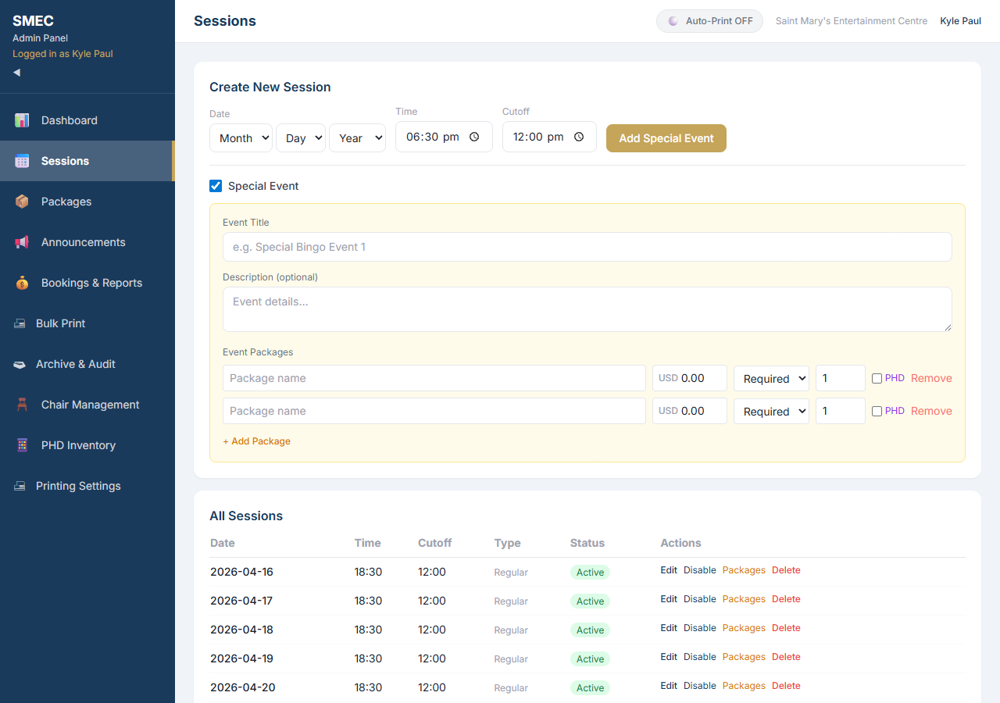

---

### Step 7: View All Sessions

Scroll down to see the **All Sessions** table:

- **Date** — event date
- **Time** — start time (shown in gold)
- **Cutoff** — booking deadline
- **Type** — shows "Regular" for standard sessions or the event title for special events
- **Status** — green "Active" badge (visible to customers) or disabled
- **Actions** — Edit, Disable/Enable buttons


---

### Step 8: Manage Packages (Global)

Click the **Packages** tab to view and manage global ticket packages that apply to all regular (non-special-event) sessions.

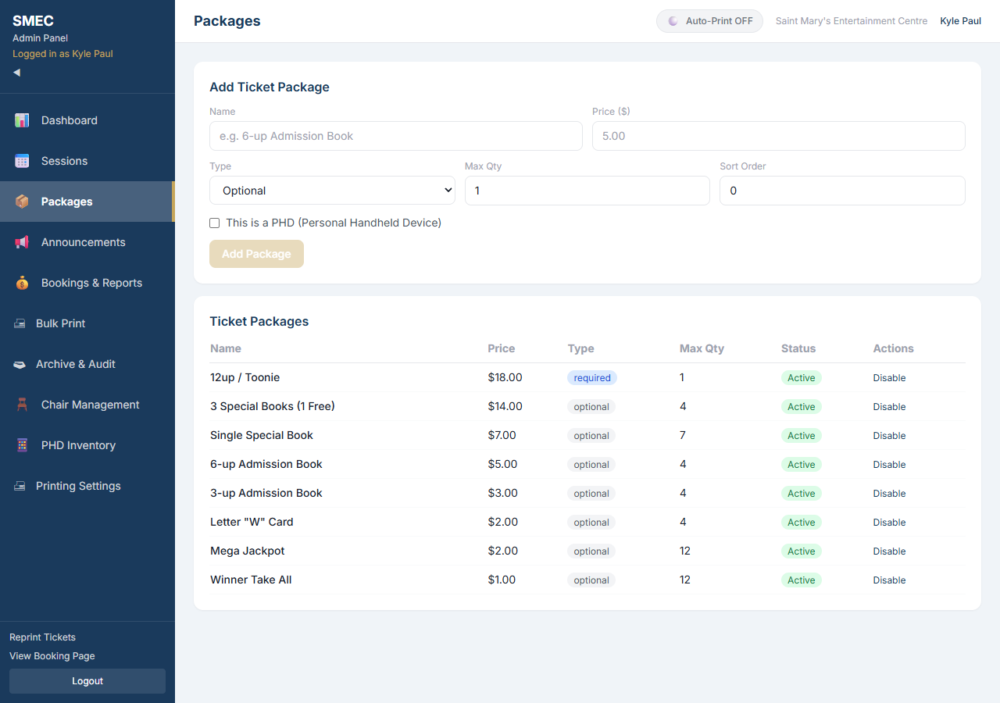

---

### Step 9: Monitor Bookings & Sales

Click the **Bookings & Reports** tab:

1. **Filter by Session** using the dropdown at the top (or select "All Sessions").
2. Click **"Export CSV"** button to download booking data as a spreadsheet.
3. View each booking with:
   - **Reference number** (e.g., BNG-CX7LUR) in bold
   - **Total amount** and payment status (green "paid" badge)
   - **Attendee details**: name, table, chair, package, add-ons
4. **Actions per booking:**
   - **Print Tickets** — opens printable ticket view
   - **Cancel Booking** (red) — releases seats back to available

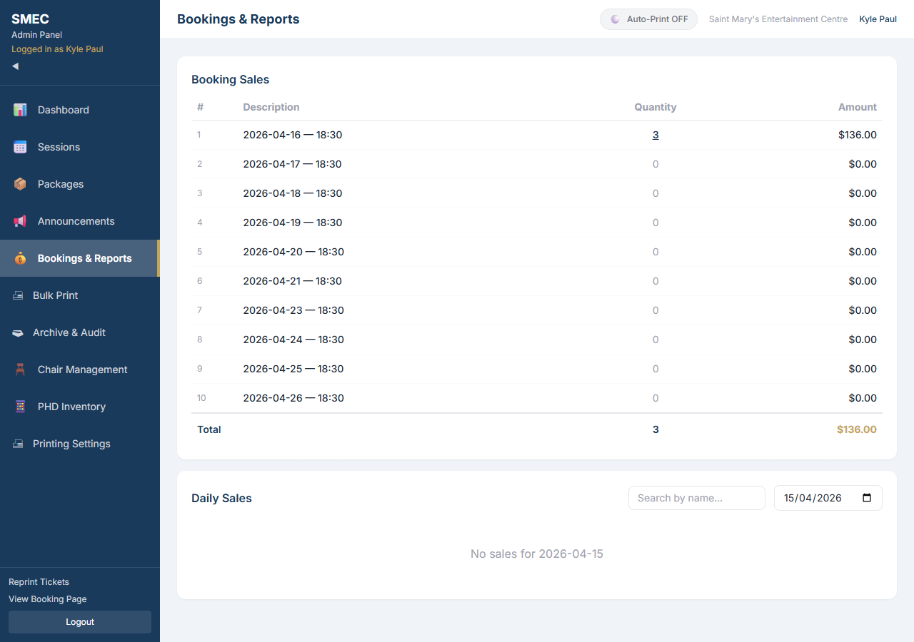

---

### Step 10: Bulk Print Tickets

Click the **Bulk Print** tab:

1. **Select "From Date"** (required).
2. **Select "To Date"** (optional — defaults to same day).
3. Click **"Load Tickets"** to see a summary.
4. Review results: total ticket count, breakdown by session, special events shown with amber badge.
5. Click **"Print All (X tickets)"** to open browser print dialog.
6. Tickets print **3 per page** with venue copy and customer copy.

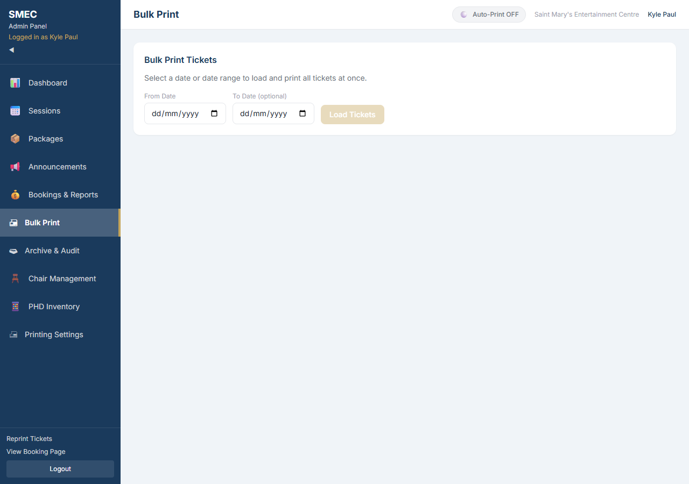

---

### Step 11: Create Announcements (Optional)

Click the **Announcements** tab:

1. Enter a **Title** (optional).
2. Select the **Type** from dropdown:
   - **Info (Blue)** — general information
   - **Warning (Amber)** — important notice
   - **Success (Green)** — positive news
3. Enter the **Message** (required).
4. Set **Start Date** and **End Date** (optional — controls when it appears).
5. Click **"Create Announcement"** (coral/red button).
6. The announcement appears on the public booking page in real time.

Below the form, you can see **All Announcements** with options to activate/deactivate or delete.

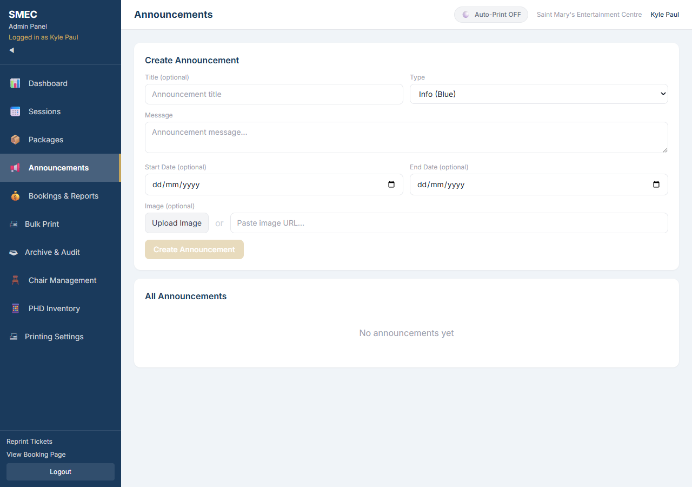

---
---

# Quick Reference Card

## Customer Booking Flow
```
Homepage --> Select Session --> Pick Seats --> Party Size --> Names & Packages --> Review --> Pay --> Confirmation --> Print Tickets
```

## Admin Event Setup Flow
```
Login --> Sessions Tab --> Create Session --> Enable Special Event --> Add Title --> Configure Packages --> Save --> Monitor Bookings
```

## Key URLs

| Page | URL |
|------|-----|
| Homepage (Booking) | https://bingo-jk2h.onrender.com |
| Ticket Lookup | https://bingo-jk2h.onrender.com/tickets |
| View Tickets | https://bingo-jk2h.onrender.com/tickets/{reference-number} |
| Admin Login | https://bingo-jk2h.onrender.com/admin |
| Admin Dashboard | https://bingo-jk2h.onrender.com/admin/dashboard |

## Key Terms

| Term | Meaning |
|------|---------|
| **Session** | A scheduled bingo event on a specific date and time |
| **Special Event** | A session with a custom title, description, and unique packages |
| **Package** | A ticket type with a name and price (required or add-on) |
| **Reference Number** | Unique booking ID (format: BNG-XXXXXX) |
| **Cutoff Time** | Deadline for online booking before the session starts |
| **Hold Timer** | 10-minute lock on selected seats to prevent double-booking |
| **SMEC** | Saint Mary's Entertainment Centre (venue name) |
